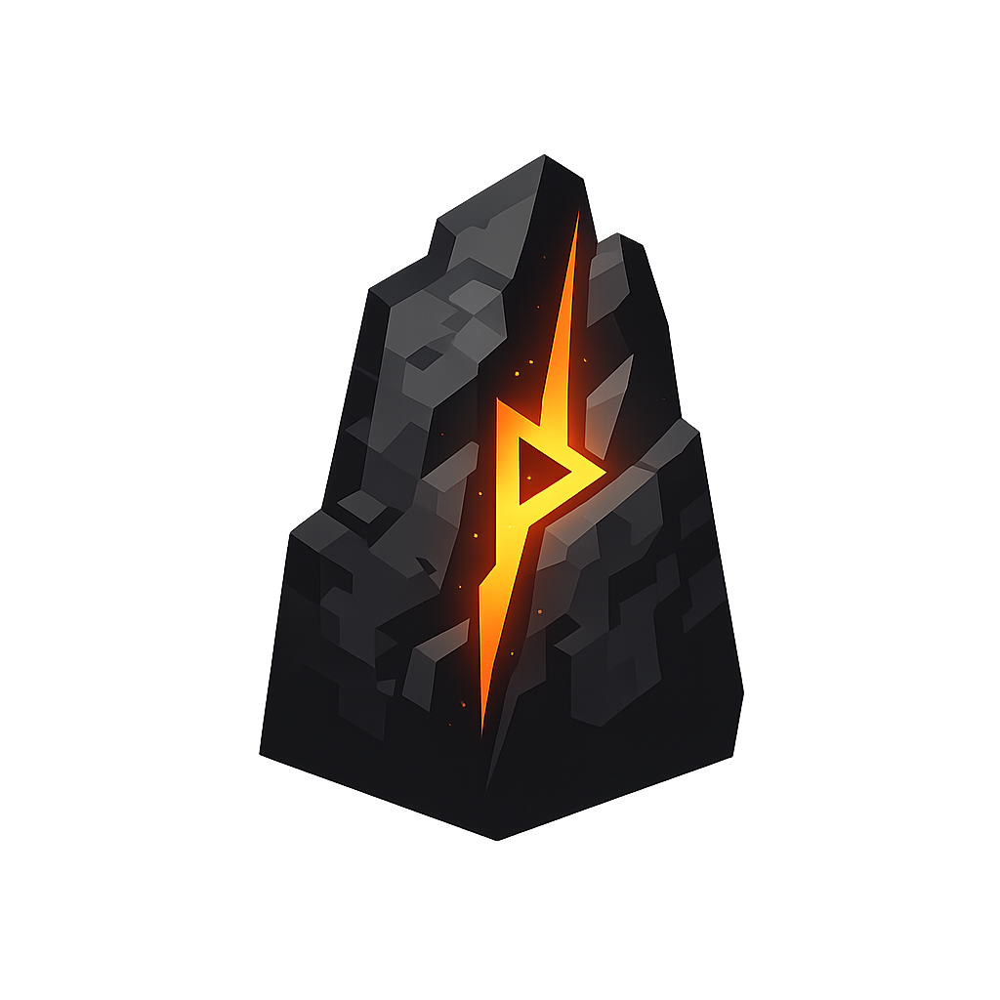
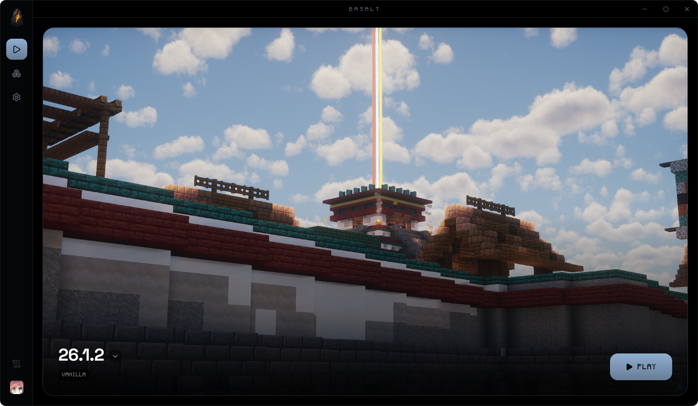

<div align="center">
  
  <h1>Basalt</h1>
  <p><strong>A Minecraft launcher where the game is the interface.</strong></p>
  <p>Your world fills the window. The UI tints itself from your banner. The chrome gets out of the way.</p>
</div>



<br>

## Instances that stay out of each other's way

Each instance owns its saves, mods, resource packs, shaders, and options. Memory and
Java can be overridden per instance, versions and loaders can be changed later with
warnings that tell the truth about what breaks, and playtime is tracked automatically.

## Loaders without the ritual

**Fabric**, **Quilt**, **NeoForge**, and **Forge**, set up by the launcher. Fabric and
Quilt install from their official metadata in seconds; NeoForge and Forge run the
official installer headlessly. Pick a loader at creation or switch an existing
instance, then press Install.

## Content that knows where it came from

Search **Modrinth** and **CurseForge** without leaving the launcher. Results are
filtered to your instance's version and loader, already-installed projects say so,
and required dependencies are shown for approval before anything extra downloads.
Project pages carry the description, gallery, and a versions browser that highlights
compatible builds, marks the one you have, and turns newer ones into one-click
updates. Every installed file stays linked to its source project and exact version.

## The details

- Microsoft sign-in via device code, multiple accounts, silent token refresh, and
  your actual skin as the avatar.
- Live console with severity-colored logs, process state, and crash-readable output.
- Every artifact with a published hash is SHA1 verified; downloads run concurrently
  and skip what is already valid.
- Rust backend (Tauri 2) talking straight to piston-meta, launchercontent, the Fabric
  and Quilt meta services, official installers, and the platform APIs. SQLite for
  state. The app-wide accent color is extracted from your banner in Rust.

## Status

In active development on Linux, unpackaged, sharp edges included. The full loop works
today: sign in, create an instance, add a loader and mods, play. CurseForge search
needs a free API key from console.curseforge.com (their API is keyed per application);
paste it in Settings.

## Running it

Rust, Bun, and webkit2gtk. Then:

```
bun install
bun run tauri dev
```
