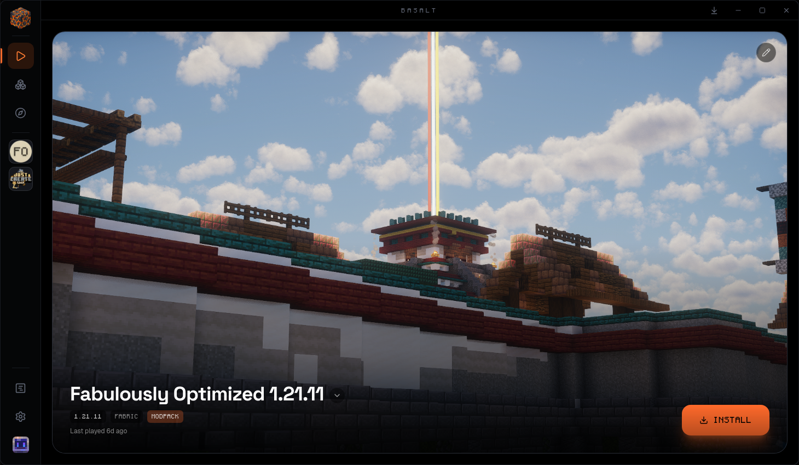
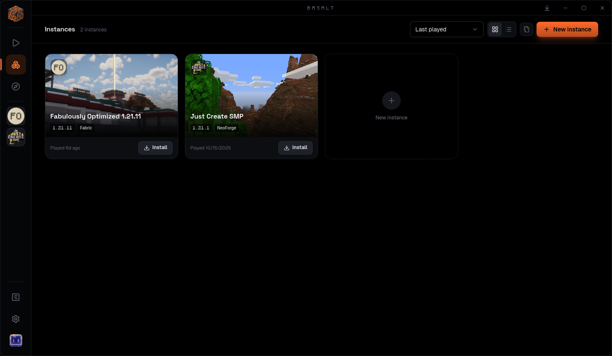
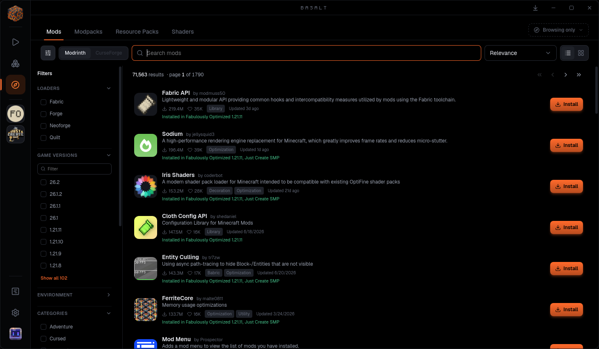
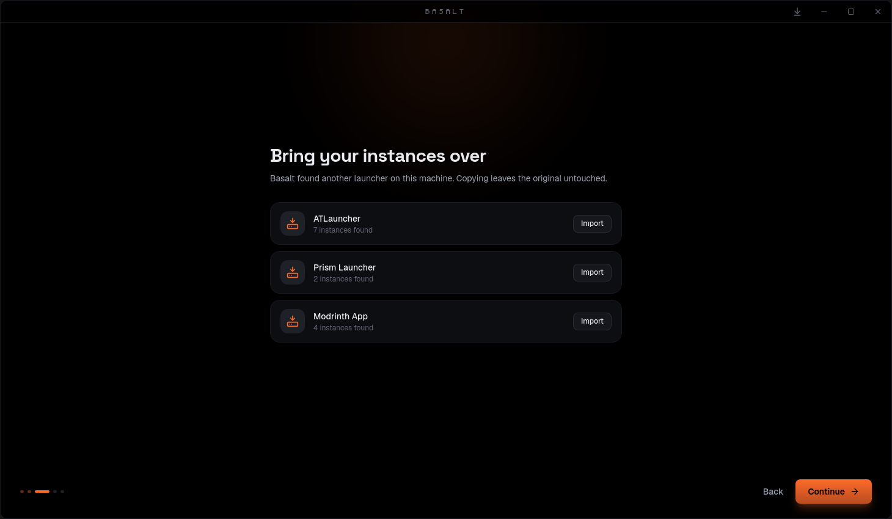
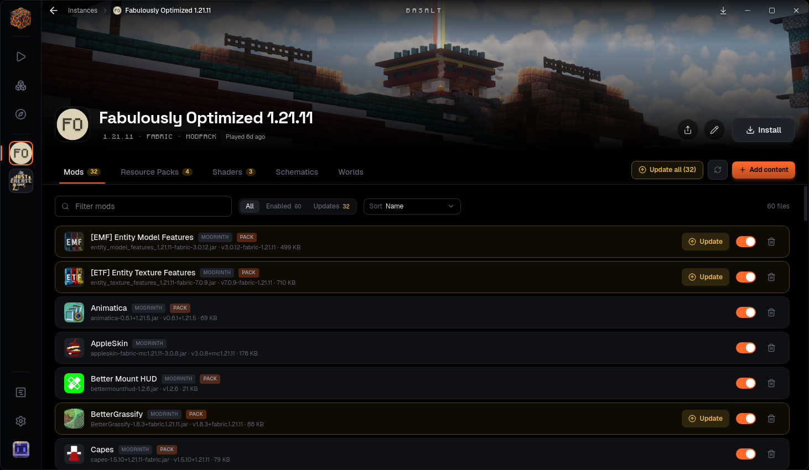
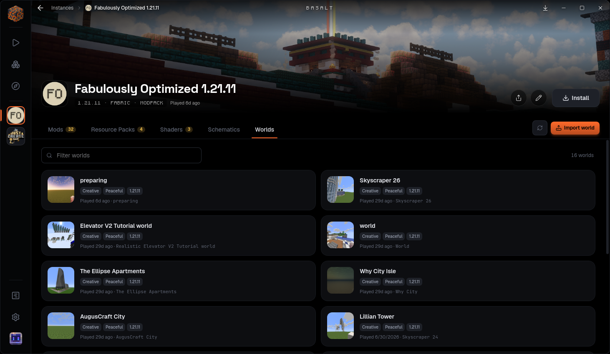
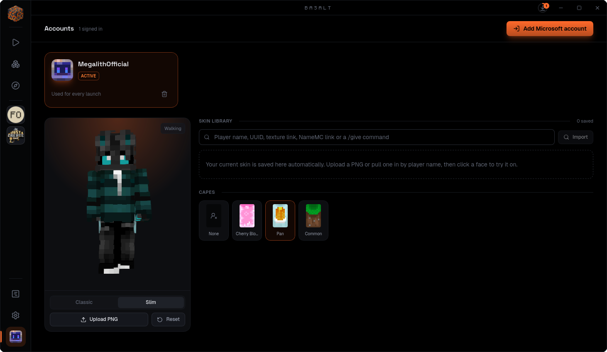

<div align="center">
  
  <h1>Basalt</h1>
  <p>A polished Minecraft launcher that puts form and function on equal footing.</p>

  [](#project-status)
  [](#install)
  [](https://tauri.app/)
</div>



Basalt combines an artwork-led interface with the practical tools expected from a
modern Minecraft launcher. It is designed to feel cohesive and visually considered
without giving up control over instances, loaders, content, accounts, or launch
settings.

## Screenshots

<table>
  <tr>
    <td width="50%">
      
      <br><sub><b>Instance library</b> — keep every setup separate and easy to find.</sub>
    </td>
    <td width="50%">
      
      <br><sub><b>Content discovery</b> — search, filter, and install compatible content.</sub>
    </td>
  </tr>
  <tr>
    <td width="50%">
      
      <br><sub><b>Launcher imports</b> — bring instances over without modifying the originals.</sub>
    </td>
    <td width="50%">
      
      <br><sub><b>Per-instance content</b> — manage files, updates, and enabled state in one place.</sub>
    </td>
  </tr>
  <tr>
    <td width="50%">
      
      <br><sub><b>World management</b> — view and manage worlds alongside their instance.</sub>
    </td>
    <td width="50%">
      
      <br><sub><b>Accounts and appearance</b> — manage profiles, skins, and capes together.</sub>
    </td>
  </tr>
</table>

## Features

- **Instance management.** Keep saves, mods, resource packs, shaders, settings, and
  launch options separate for every instance.
- **Loader support.** Install and switch between Fabric, Quilt, NeoForge, and Forge.
- **Content discovery.** Browse Modrinth and CurseForge with compatibility filtering,
  dependency resolution, changelogs, and update checks.
- **Modpack installation.** Create an instance directly from a Modrinth modpack.
- **Microsoft accounts.** Manage multiple accounts with device-code sign-in and
  silent token refresh.
- **Skins and capes.** Import, preview, save, and apply skins, then manage capes from
  the same interface.
- **Java detection.** Find compatible runtimes from the system and common version
  managers, with global and per-instance overrides.
- **Visible background work.** Follow downloads and installs, cancel active tasks,
  and recover interrupted operations.
- **Useful diagnostics.** Keep launcher logs separate from game output, change log
  levels, and preview final launch arguments.

## Project status

Basalt is cross-platform software for Linux, Windows, and macOS. Testing
coverage still varies between platforms, so platform-specific bug reports are
especially useful during the beta.

## Install

[GitHub Releases](https://github.com/MegalithOfficial/basalt-launcher/releases) provide
installers for every supported desktop platform:

- **Windows:** `.exe` and `.msi`
- **macOS:** `.dmg`
- **Linux:** AppImage and Debian package

Arch users can install `basalt-launcher-bin` from the AUR for stable releases, or
`basalt-launcher-dev-bin` for the latest development prerelease.

Nix and NixOS users can build and run Basalt directly from source:

```bash
nix run github:MegalithOfficial/basalt-launcher
```

To build the latest development source with development-only features enabled:

```bash
nix run github:MegalithOfficial/basalt-launcher#dev
```

## Launching an instance directly

Use `-l` or `--launch` to start an instance without opening the launcher first:

```bash
basalt-launcher -l 4f9c2a81
basalt-launcher --launch "My instance"
```

Names work when they are unique. ID prefixes are unambiguous and must be at least
eight characters; Basalt accepts the full instance ID too.

`-L` or `--list` prints every instance next to the selector that launches it, then
exits without opening a window:

```bash
$ basalt-launcher --list
d241539f	Fabulously Optimized 1.21.11
36e80ff1	Just Create SMP
```

To skip the lookup entirely, open an instance's menu and choose
**Copy launch argument**. Paste it into a desktop shortcut, a Steam launch
option, or anything else that runs a command.

## Running from source

To run it locally, install [Rust](https://rustup.rs/), [Bun](https://bun.sh/), and the
[native dependencies required by Tauri](https://v2.tauri.app/start/prerequisites/).
Then, from the repository root:

```bash
bun install
bun run tauri dev
```

## CurseForge

Modrinth works without additional configuration. Release builds ship with a
CurseForge key, so CurseForge search and modpack installs work out of the box.

Building from source is the case that needs your own key, because the key is
compiled in from `BASALT_CURSEFORGE_API_KEY` at build time. Set that variable
before building, or paste a key under **Settings → Integrations**, which takes
precedence over the compiled one.

Getting a key takes longer than the console suggests. Sign in at
[console.curseforge.com](https://console.curseforge.com/) and open the
**API KEYS** tab, but the key shown there answers `403` until CurseForge approves
an application request for it, which is a manual review on their side.

Never commit an API key or include one in a bug report.

## Contributing

Read [CONTRIBUTING.md](CONTRIBUTING.md) before opening a pull request. It covers the
project architecture, code expectations, validation commands, and review process.

## Disclaimer

NOT AN OFFICIAL MINECRAFT PRODUCT. NOT APPROVED BY OR ASSOCIATED WITH MOJANG OR
MICROSOFT.

Basalt downloads game files from Mojang's own servers and never redistributes
them. Minecraft is a trademark of Mojang AB.

## Support

Use [GitHub Issues](https://github.com/MegalithOfficial/basalt-launcher/issues) to
report a reproducible bug or propose a feature. Include the launcher logs, operating
system, Minecraft version, and loader when relevant.
